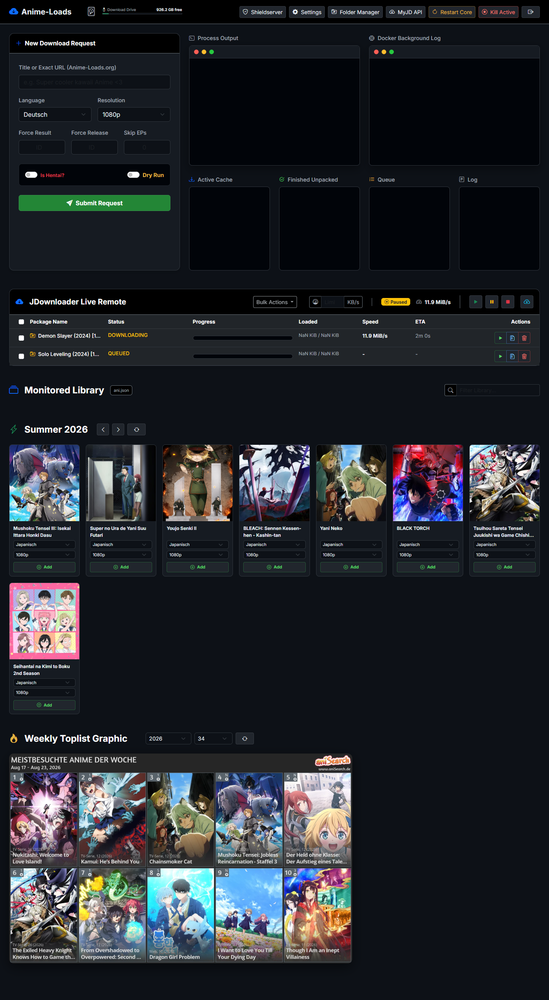
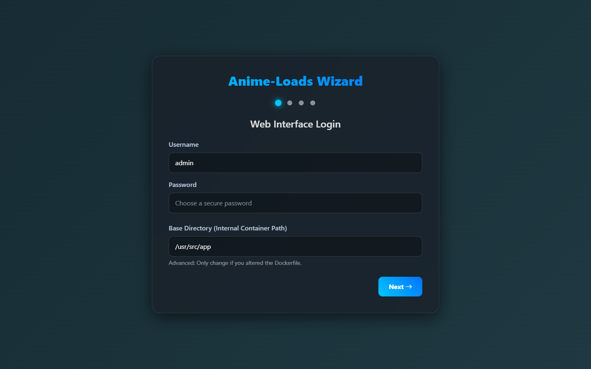
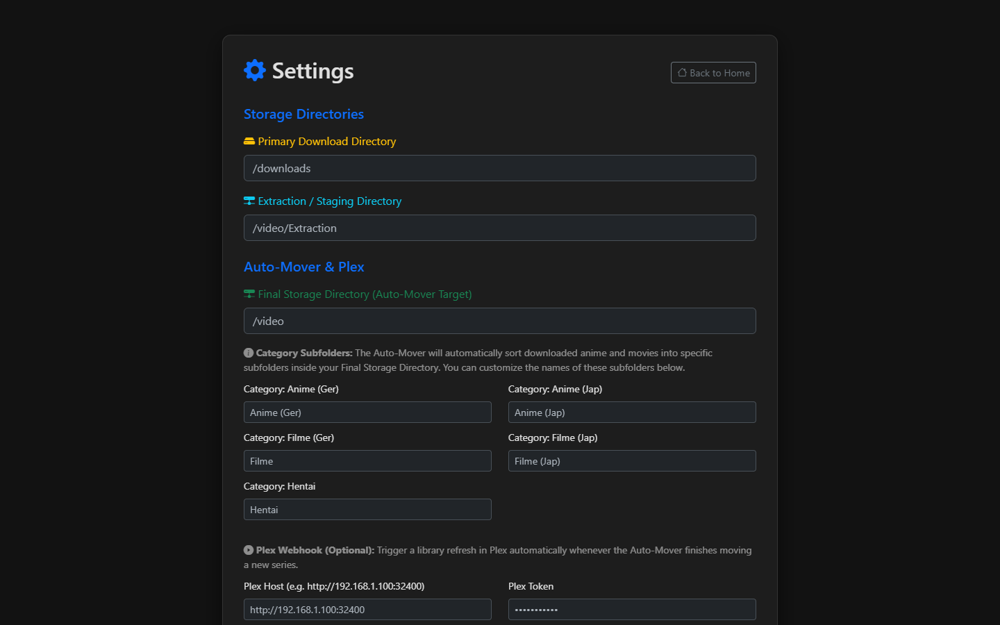
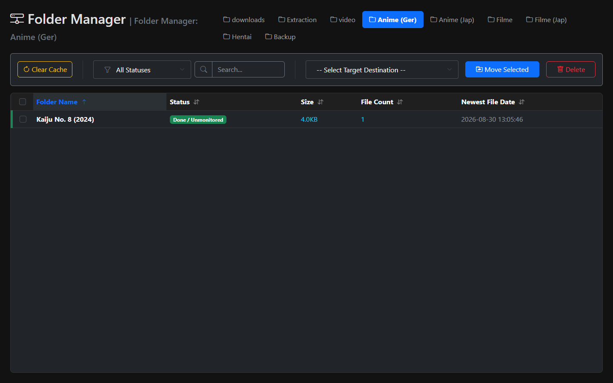

# Anime-Loads Universal Docker 🎬📦


A fully automated, self-hosted Anime and Movie downloader for [Anime-Loads](https://www.anime-loads.org/), packed into a portable, easy-to-use Docker container. 

This project is a complete modern rewrite of the original bare-metal Python CLI scripts, bringing a premium Web UI, an interactive Setup Wizard, automated smart-moving, and Plex integration into a single containerized solution!

---

## 📸 Interface Showcase

**The Modern Dashboard** — Monitor your active downloads, see disk usage, and manage your JDownloader queue directly from the WebUI.


**Interactive Setup Wizard** — A simple 4-step wizard guides you through configuring your paths, JDownloader credentials, and Plex integrations without ever touching a config file.


**Settings & Validation** — Tweak your setup on the fly with live credential validation for JDownloader and Plex Webhooks.


**Smart Folder Manager** — Easily move finished extractions from your staging drives to your final long-term storage or USB drives with a single click.


---

## ✨ Key Features

- **Universal Docker Container**: Everything you need (PHP, Nginx, Python, Selenium/Geckodriver, Cron) is baked into a single image. No complex host dependencies!
- **Beautiful Web Interface**: A premium, responsive dashboard built with Bootstrap 5 and modern styling.
- **Automated "Set and Forget"**: 
  - Add an anime URL to your monitored list.
  - The container automatically checks for new episodes in the background every few minutes.
  - Episodes are sent to JDownloader automatically.
- **Smart Auto-Mover**: Once JDownloader finishes extracting a file, the built-in `auto_mover.py` detects it and smoothly transfers it to your final storage drive.
- **Plex Integration**: Automatically triggers a Plex Library scan via Webhook as soon as new episodes are moved to your final storage.
- **Folder Manager**: Built-in tool to archive and organize your finished series across multiple disks or USB drives.

---

## 🚀 Quickstart Guide

Deploying the container is incredibly simple. All configuration is done through the WebUI on your first visit!

### Using Docker Run

```bash
docker run -d \
  --name anime-loads \
  -p 8080:80 \
  -v /path/to/your/appdata/anime-loads:/config \
  -v /path/to/downloads:/downloads \
  -v /path/to/final/media:/video \
  anime-loads-universal:latest
```

### Using Docker Compose

```yaml
version: "3"
services:
  anime-loads:
    image: anime-loads-universal:latest
    container_name: anime-loads
    ports:
      - "8080:80"
    volumes:
      - ./config:/config           # Configuration and Database
      - /mnt/downloads:/downloads  # Where JDownloader downloads/extracts
      - /mnt/media:/video          # Your final Plex media storage
    restart: unless-stopped
```

Once the container is running, open your browser and navigate to:
`http://localhost:8080`

You will automatically be redirected to the **Setup Wizard** to complete your installation!

---

## ⚙️ How It Works (Architecture)

1. **Frontend (PHP/Nginx)**: Serves the WebUI, the Dashboard, and the Folder Manager. When you add a new Anime, it saves the details to `/config/ani.json`.
2. **Backend (Python)**: `download_anime.py` runs automatically via Cron. It reads your `/config/ani.json`, checks Anime-Loads for new episodes (using headless Firefox if necessary), and pushes download links directly to your linked JDownloader account.
3. **Auto-Mover (Python)**: `auto_mover.py` runs every 5 minutes to scan your Extraction Directory. When it finds finished episodes, it moves them to your Final Storage Directory and hits your Plex Webhook to refresh your library.

---

## 🛠️ Requirements & Notes

- **JDownloader**: You must have an active instance of JDownloader connected to your [MyJDownloader](https://my.jdownloader.org/) account. The container sends links remotely to your JDownloader instance.
- **Storage Volumes**: You must map your download directories into the container so the WebUI and Auto-Mover can see the files.
- **Legacy Python Scripts**: The original CLI tools (`animeloads.py`, `downloader.py`, `anibot.py`) are still present under the hood, but are now orchestrated entirely by the WebUI and background cron jobs.
